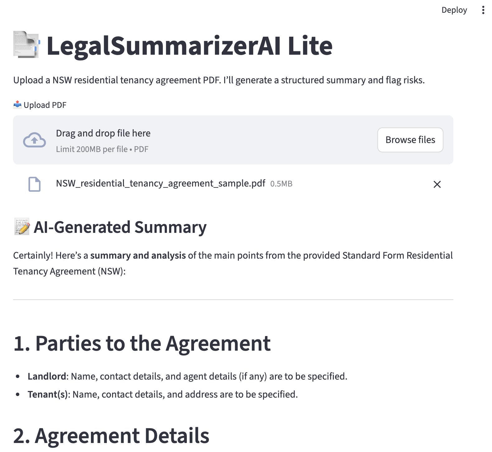

# 🧠 LegalSummarizerAI Lite

AI-powered assistant to summarise New South Wales (NSW) residential tenancy agreements into structured, legally relevant summaries.

---

## 📄 Project Links
- 📂 [Source Code](https://github.com/biosciences/LegalSummarizerAILite): Explore the full repository
- 🔗 [Live Report](https://biosciences.github.io/LegalSummarizerAILite/index.html): View the HTML output

## ✨ Features

- 📤 Upload NSW tenancy PDF contracts
- 📄 Extracts parties, rent, bond, obligations, dates, and key clauses
- ⚠️ Highlights potential legal risks based on Residential Tenancies Act 2010 (NSW)
- 🌐 Auto language detection: English and 简体中文 supported
- 📥 Download summary as Word, PDF, or shareable HTML
- 🚀 Deploy-ready with Streamlit or Render

---

## 🖼️ Demo Screenshot

Here’s what the app looks like when in use:



> 📎 This screenshot shows summary generation from a standard NSW residential tenancy agreement PDF.

---

## 🚀 How to Use

```bash
git clone https://github.com/your-username/LegalSummarizerAI-Lite.git
cd LegalSummarizerAI-Lite
pip install -r requirements.txt
export OPENAI_API_KEY=sk-xxxxxxxxxxxxxxxxxxxxx
streamlit run app/app.py
```

---

## 📄 Output Formats

- `summary.docx` – editable Word version
- `summary.pdf` – printable report
- `docs/summary.html` – stylized HTML summary (GitHub Pages friendly)

---

## 📎 GitHub Pages Example

```text
https://your-username.github.io/LegalSummarizerAI-Lite/summary.html
```

---

## 🧠 Powered By

- [OpenAI GPT-4.1](https://openai.com/)
- [Streamlit](https://streamlit.io/)
- [PyMuPDF](https://github.com/pymupdf/PyMuPDF)
- [markdown](https://python-markdown.github.io/)
